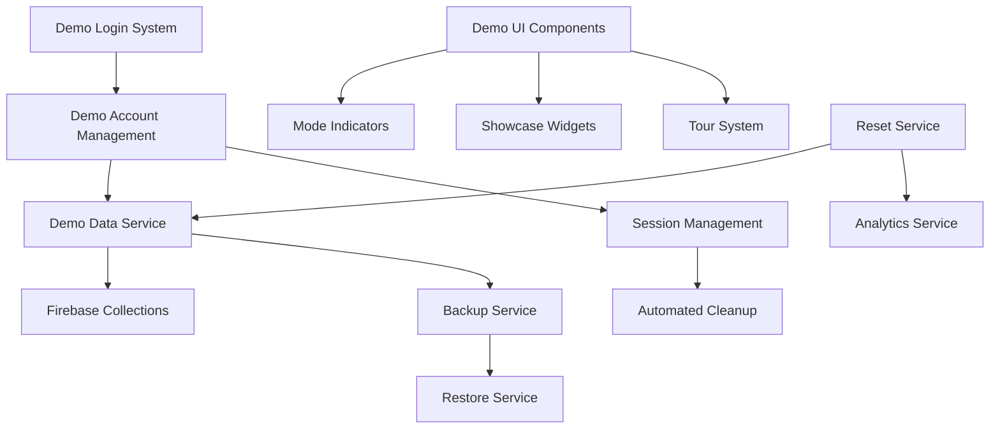

# SnapAMeal Demo System Guide

## Overview

The SnapAMeal Demo System provides a comprehensive investor demonstration platform with realistic health & fitness data, AI-powered features, and social interactions. This guide covers setup, usage, and maintenance of the demo system.

## Table of Contents

1. [Architecture Overview](#architecture-overview)
2. [Demo Account Setup](#demo-account-setup)
3. [Firebase Configuration](#firebase-configuration)
4. [Demo Data Management](#demo-data-management)
5. [Usage Guide](#usage-guide)
6. [Maintenance Procedures](#maintenance-procedures)
7. [Troubleshooting](#troubleshooting)
8. [API Reference](#api-reference)

## Architecture Overview

### Core Components



### Demo-Specific Collections

- `demo_users` - Demo user profiles and health data
- `demo_meal_logs` - AI-analyzed meal logs with nutrition data
- `demo_fasting_sessions` - Fasting timer and session history
- `demo_health_groups` - Social health communities
- `demo_ai_advice` - RAG-powered personalized recommendations
- `demo_stories` - Social stories with engagement metrics
- `demo_chat_rooms` - Group chat conversations
- `demo_session_data` - Active demo session tracking
- `demo_analytics` - Usage analytics and metrics
- `demo_reset_history` - Reset operation audit trail

## Demo Account Setup

### Demo Accounts Overview

The application uses three demo personas with comprehensive health profiles:

#### Alice (alice.demo@example.com)
- **Password**: `DemoAlice2024!`
- **Profile**: 34-year-old freelancer
- **Health Goals**: Weight loss, energy
- **Fasting**: 14:10 intermittent fasting
- **Activity**: Moderate
- **Session Duration**: 4-hour sessions

#### Bob (bob.demo@example.com)
- **Password**: `DemoBob2024!`
- **Profile**: 25-year-old retail worker
- **Health Goals**: Muscle gain, strength
- **Fasting**: 16:8 intermittent fasting
- **Activity**: Active
- **Session Duration**: 6-hour sessions

#### Chuck (charlie.demo@example.com)
- **Password**: `DemoCharlie2024!`
- **Profile**: 41-year-old teacher
- **Health Goals**: Weight loss, health
- **Fasting**: 5:2 fasting
- **Activity**: Light
- **Diet**: Vegetarian
- **Session Duration**: 2-hour sessions

### Setup Methods

#### Method 1: Manual Setup (Recommended)

**Step 1: Firebase Authentication**
1. Go to [Firebase Console](https://console.firebase.google.com)
2. Select your SnapAMeal project
3. Navigate to Authentication > Users
4. Click "Add user" for each demo account:
   - Alice: `alice.demo@example.com` / `DemoAlice2024!`
   - Bob: `bob.demo@example.com` / `DemoBob2024!`  
   - Chuck: `charlie.demo@example.com` / `DemoCharlie2024!`

**Step 2: Firestore Data**
1. Navigate to Firestore Database
2. Go to the `users` collection
3. For each user created above, add a document with their UID as the document ID

**Firestore Document Structure:**

```json
// Document ID: [USER_UID_FROM_AUTH]
{
  "uid": "[USER_UID_FROM_AUTH]",
  "email": "alice.demo@example.com",
  "username": "alice_freelancer",
  "displayName": "Alice",
  "age": 34,
  "occupation": "Freelancer",
  "isDemo": true,
  "demoPersonaId": "alice",
  "healthProfile": {
    "height": 168,
    "weight": 63.5,
    "gender": "female",
    "fastingType": "14:10",
    "calorieTarget": 1600,
    "activityLevel": "moderate",
    "goals": ["weight_loss", "energy"],
    "dietaryRestrictions": []
  },
  "lastReplayTimestamp": null,
  "createdAt": "[SERVER_TIMESTAMP]"
}
```

Repeat for Bob and Charlie with their respective data.

#### Method 2: Automated Setup Scripts

**Option A: Firebase Admin SDK Script**

1. Download Firebase service account key:
   - Firebase Console > Project Settings > Service Accounts
   - Click "Generate new private key"
   - Save as `firebase-service-account.json` in project root

2. Run the setup script:
```bash
cd functions
GOOGLE_APPLICATION_CREDENTIALS=../firebase-service-account.json node seed_demo_accounts.js
```

**Option B: Flutter-based Script**
```bash
# Run the demo account creation script
dart run scripts/seed_demo_accounts.dart
```

**Option C: Simple Instructions Script**
```bash
# Get copy-paste ready setup instructions
dart scripts/seed_accounts_firebase_only.dart
```

#### Method 3: Firebase CLI Import

You can also use Firebase CLI with Firestore import/export:

```bash
# Export current data (backup)
firebase firestore:export ./backup

# Create demo data file and import
firebase firestore:import ./demo-data
```

#### Method 4: App-Level Demo Data Loading

The app's `AuthService` has built-in demo account creation. When users try to sign in with demo accounts that don't exist, the app will automatically create them. This requires the accounts to be present in Firebase Authentication first.

### Firestore Security Rules

Deploy the demo-specific security rules:

```bash
firebase deploy --only firestore:rules
```

Key security features:
- Demo accounts isolated from production data
- Cross-demo-user read access for social features
- Automated cleanup permissions
- Analytics collection restrictions

### Demo Data Seeding

Initialize demo data for all personas:

```bash
dart run scripts/seed_demo_data.dart
```

This creates:
- 30+ days of realistic health tracking data
- Social connections between demo users
- Group chat histories
- AI advice interaction history
- Progress stories with varied engagement

### Verification

After setting up the demo accounts:

1. **Test Demo Login**: Use the app's demo login feature
2. **Check Data**: Verify user profiles appear correctly in the health dashboard
3. **Test Features**: Ensure demo-specific features work (replay limitations, etc.)

### Troubleshooting Demo Account Setup

#### Flutter SDK Issues
If you encounter Flutter compilation errors when running the Dart scripts:
- Use Method 1 (Manual Setup) instead
- The issue is with Flutter SDK, not the demo account logic

#### Firebase Connection Issues
If Node.js scripts fail to connect:
- Ensure you have the correct service account key
- Set the GOOGLE_APPLICATION_CREDENTIALS environment variable
- Check that your Firebase project is properly configured

#### Authentication Errors
If demo accounts can't sign in:
- Verify the exact email addresses and passwords
- Check that the accounts exist in Firebase Authentication
- Ensure the Firestore documents have the correct structure

### Security Notes

- Demo accounts use strong passwords but should only be used in development/demo environments
- The `isDemo: true` flag helps identify demo accounts for special handling
- Demo accounts have limited replay functionality built into the app

## Firebase Configuration

### Environment Setup

1. **Development Environment**
   ```bash
   # Use demo project
   firebase use demo-project-id
   
   # Deploy functions with demo flag
   firebase deploy --only functions --project demo-project-id
   ```

2. **Production Isolation**
   ```bash
   # Separate Firebase projects recommended
   firebase use prod-project-id  # Production
   firebase use demo-project-id  # Demo/Staging
   ```

### Collection Structure

```typescript
// Demo collections use 'demo_' prefix
collections: {
  demo_users: {
    [userId]: {
      healthProfile: HealthProfile,
      preferences: UserPreferences,
      socialConnections: string[],
      createdAt: Timestamp,
      // ... other user data
    }
  },
  demo_meal_logs: {
    [logId]: {
      user_id: string,
      recognitionResult: MealRecognitionResult,
      timestamp: Timestamp,
      // ... meal data
    }
  }
  // ... other collections
}
```

## Demo Data Management

### Data Lifecycle

1. **Initial Seeding** - Rich historical data for 30+ days
2. **Session Tracking** - Real-time user interactions
3. **Automated Cleanup** - Session expiry and reset
4. **Backup/Restore** - Data preservation and recovery

### Demo Reset Operations

```dart
// Reset current user's demo data
final resetService = DemoResetService();
await resetService.resetCurrentUserDemoData();

// Reset all demo data (admin)
await resetService.resetAllDemoData();

// Get reset statistics
final stats = await resetService.getDemoDataStats();
```

### Backup and Restore

```dart
// Create full backup
final backupService = DemoBackupService();
final result = await backupService.createFullBackup();

// Create user-specific backup
final userBackup = await backupService.createUserBackup(userId);

// Restore from backup
final restoreResult = await backupService.restoreFromBackup(backup);
```

## Usage Guide

### For Investors/Demos

1. **Quick Demo Login**
   - Use demo login buttons on login screen
   - Instant authentication with pre-seeded data
   - No password required

2. **Demo Features**
   - Fasting timers with AR filters
   - AI meal recognition showcase
   - Health dashboard with progress visualization
   - Social features (groups, stories, chat)
   - RAG-powered AI advice

3. **Demo Indicators**
   - Subtle "DEMO" indicators throughout app
   - Demo tour system for guided walkthrough
   - Contextual tooltips for complex features

### For Developers

1. **Enable Demo Mode**
   ```dart
   // Check if user is in demo mode
   final authService = AuthService();
   final isDemo = await authService.isCurrentUserDemo();
   
   // Show demo-specific UI
   if (isDemo) {
     return DemoModeIndicator();
   }
   ```

2. **Demo Data Access**
   ```dart
   // Access demo data service
   final demoService = DemoDataService();
   
   // Seed data for specific persona
   await demoService.seedPersonaData(userId, 'alice.demo@example.com');
   
   // Check if user has demo data
   final hasData = await demoService.hasDemoData(userId);
   ```

3. **Session Management**
   ```dart
   // Initialize demo session
   final accountService = DemoAccountManagementService();
   await accountService.initializeDemoSession(userId);
   
   // Update activity
   await accountService.updateSessionActivity(userId);
   
   // Validate session
   final status = await accountService.validateDemoAccount(userId);
   ```

## Maintenance Procedures

### Daily Maintenance

1. **Session Cleanup**
   ```dart
   // Clean up inactive sessions (24+ hours)
   final accountService = DemoAccountManagementService();
   await accountService.cleanupInactiveSessions();
   ```

2. **Analytics Review**
   ```dart
   // Get usage analytics
   final analytics = await accountService.getUsageAnalytics();
   print('Active sessions: ${analytics.activeSessions}');
   print('Average duration: ${analytics.averageSessionDuration}');
   ```

### Weekly Maintenance

1. **Demo Data Reset**
   ```bash
   # Reset all demo accounts to fresh state
   dart run scripts/reset_demo_environment.dart
   ```

2. **Backup Creation**
   ```dart
   // Create weekly backup
   final backupService = DemoBackupService();
   final backup = await backupService.createFullBackup();
   final filePath = await backupService.saveBackupToFile(backup);
   ```

3. **Performance Review**
   - Check Firebase usage metrics
   - Review session duration statistics
   - Monitor reset frequency

### Monthly Maintenance

1. **Data Archival**
   - Archive old demo session logs
   - Clean up expired backup files
   - Review storage usage

2. **Security Audit**
   - Verify demo account isolation
   - Check Firestore security rules
   - Review access logs

## Troubleshooting

### Common Issues

1. **Demo Login Not Working**
   ```dart
   // Check Firebase Authentication
   final user = FirebaseAuth.instance.currentUser;
   print('Current user: ${user?.email}');
   
   // Verify demo account exists
   final isDemoEmail = ['alice.demo@example.com', 'bob.demo@example.com', 'charlie.demo@example.com']
       .contains(user?.email);
   ```

2. **Missing Demo Data**
   ```dart
   // Re-seed demo data
   final demoService = DemoDataService();
   await demoService.seedPersonaData(userId, userEmail);
   
   // Verify data exists
   final hasData = await demoService.hasDemoData(userId);
   print('Has demo data: $hasData');
   ```

3. **Session Expired**
   ```dart
   // Check session status
   final accountService = DemoAccountManagementService();
   final status = await accountService.validateDemoAccount(userId);
   
   if (status.needsReset) {
     // Trigger reset
     final resetService = DemoResetService();
     await resetService.resetCurrentUserDemoData();
   }
   ```

### Debug Commands

```bash
# Check Firebase connection
flutter pub run firebase_core:check

# Verify Firestore rules
firebase firestore:rules:get

# Test demo data seeding
dart run scripts/test_demo_seeding.dart

# Generate debug report
dart run scripts/demo_debug_report.dart
```

### Error Codes

- `DEMO_001` - Demo account not found
- `DEMO_002` - Session expired
- `DEMO_003` - Data seeding failed
- `DEMO_004` - Reset operation failed
- `DEMO_005` - Backup/restore error

## API Reference

### DemoDataService

```dart
class DemoDataService {
  // Check if user has demo data
  Future<bool> hasDemoData(String userId);
  
  // Seed persona-specific data
  Future<void> seedPersonaData(String userId, String email);
  
  // Get demo data statistics
  Future<DemoDataStats> getDemoDataStats(String userId);
}
```

### DemoResetService

```dart
class DemoResetService {
  // Reset current user's demo data
  Future<void> resetCurrentUserDemoData();
  
  // Reset all demo data (admin)
  Future<void> resetAllDemoData();
  
  // Validate data integrity
  Future<bool> validateDemoDataIntegrity();
}
```

### DemoAccountManagementService

```dart
class DemoAccountManagementService {
  // Initialize demo session
  Future<void> initializeDemoSession(String userId);
  
  // Validate demo account
  Future<DemoAccountStatus> validateDemoAccount(String userId);
  
  // Get usage analytics
  Future<DemoUsageAnalytics> getUsageAnalytics();
}
```

### DemoBackupService

```dart
class DemoBackupService {
  // Create full backup
  Future<DemoBackupResult> createFullBackup();
  
  // Create user backup
  Future<DemoBackupResult> createUserBackup(String userId);
  
  // Restore from backup
  Future<DemoRestoreResult> restoreFromBackup(DemoBackup backup);
}
```

## Best Practices

### Development

1. **Isolation** - Always use demo-prefixed collections
2. **Testing** - Test with all three demo personas
3. **Cleanup** - Implement proper session cleanup
4. **Monitoring** - Track demo usage analytics

### Production Deployment

1. **Separate Projects** - Use different Firebase projects for demo/prod
2. **Security Rules** - Strict isolation between demo and production data
3. **Monitoring** - Set up alerts for demo system issues
4. **Backup Strategy** - Regular automated backups

### Performance

1. **Session Limits** - Enforce reasonable session durations
2. **Data Limits** - Limit historical data depth
3. **Cleanup** - Regular automated cleanup of expired data
4. **Caching** - Cache frequently accessed demo data

## Support

For issues with the demo system:

1. Check this documentation
2. Review error logs in Firebase Console
3. Run debug scripts for detailed diagnostics
4. Contact the development team with error codes and logs

---

**Last Updated:** December 2024  
**Version:** 2.1  
**Maintainer:** SnapAMeal Development Team 